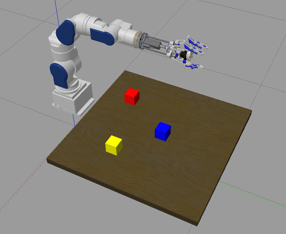

# Sia5 - Proyecto Robotica UDEA 2021 

Commands for execution:

- _Without robotic arm:_
Previously, line 37 of the file /practica/src/helpers.py must be uncommented and line 36 must be commented for the correct display of the marker.

    Rviz

        roslaunch practica test_sia5.launch
        rosrun practica directa_sia5.py
        rosrun practica ikine_sia5.py

    Gazebo

        roslaunch practica sia5_gazebo.launch
        rosrun practica prepare_pick_place.py

- _With robotic arm:_
Previously, line 36 of the file /practica/src/helpers.py must be uncommented and line 37 must be commented for the correct display of the marker.

    Rviz

        roslaunch practica test_sia5_dhand.launch
        rosrun practica directa_sia5.py
        rosrun practica ikine_sia5.py

    Gazebo 

        roslaunch practica sia_dhand_gazebo.launch
        rosrun practica prepare_pick_place.py

## Note:
For the creation of the project the following commands were used:

    mkdir -p ~/sia5_ws/src
    cd sia5_ws/src/
    git clone https://github.com/Nishida-Lab/motoman_project
    git clone https://github.com/Nishida-Lab/dhand_ros_pkg
    catkin_create_pkg practica std_msgs rospy 
    cd practica
    mkdir launch config
    cd ~/sia5_ws/
    rosdep install --from-paths src --ignore-src -r -y

In order for the project to compile correctly, the folders were removed motoman_moveit, motoman_moveit_config, motoman_perception, motoman_recognition, motoman_rviz_plugins, motoman_sia5_moveit_plugins, motoman_viz and motoman_viz_msgs.

    catkin_make

    echo "source ~/sia5_ws/devel/setup.bash" >> ~/.bashrc
    source ~/.bashrc

